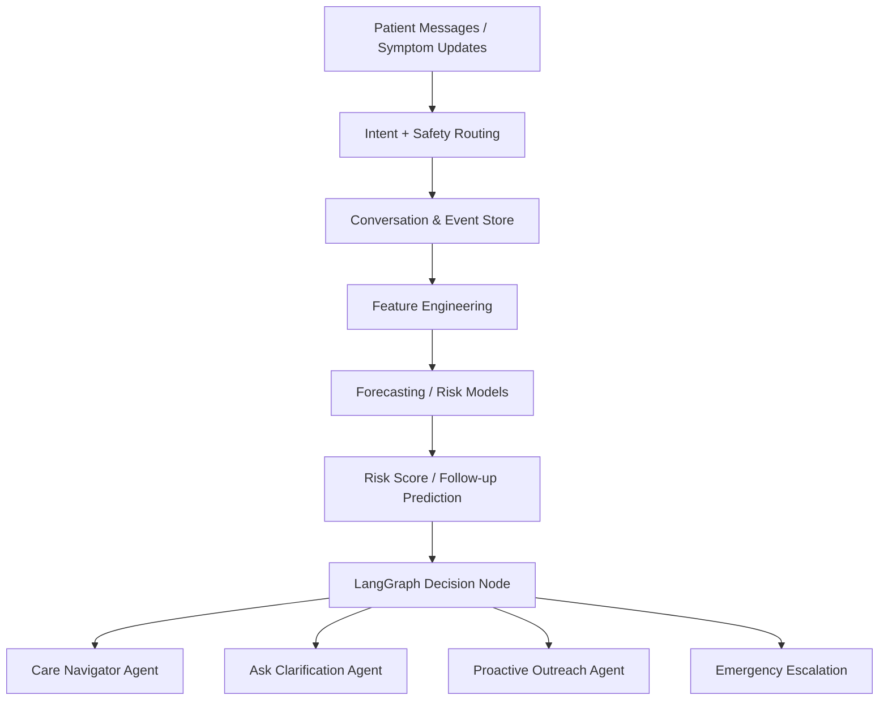

# Healthcare-ChatBot

# Healthcare Chatbot on Azure

An AI-powered healthcare chatbot built using **Azure**, **Python**, **LangGraph**, and **CopilotKit**.  
This project uses a **multi-agent workflow** to handle healthcare conversations safely and intelligently, including intent classification, emergency detection, care guidance, clarification handling, and fallback error management.

## Features

- Multi-agent healthcare chatbot using **LangGraph**
- Built with **Python**
- Integrated with **Azure OpenAI**
- UI/copilot integration using **CopilotKit**
- Observability and tracing with **Langfuse**
- Emergency-aware healthcare routing
- Clarification-based conversation flow
- Safe fallback with error handling
- Modular and extensible architecture

## Architecture

The chatbot is implemented as a **graph-based agent workflow** where each node is responsible for a specific task.

### Agents

#### 1. Welcome Agent
Handles the initial greeting and starts the conversation flow.

#### 2. Intent Classifier Agent
Classifies the user query and decides which agent should handle the request next.

#### 3. Medical Emergency Agent
Detects emergency symptoms or high-risk medical scenarios and responds with urgent safety guidance.

#### 4. Care Navigator Agent
Guides the user to the most appropriate care option based on symptoms or request type.

#### 5. Ask Clarification Agent
Requests more details when the user input is vague, incomplete, or ambiguous.

#### 6. Error Handler Agent
Handles unexpected issues, failures, or invalid states in the workflow.

## Tech Stack

- **Cloud:** Azure
- **Language:** Python
- **LLM Orchestration:** LangGraph
- **Copilot UI:** CopilotKit
- **Model Provider:** Azure OpenAI
- **Observability:** Langfuse
- **Backend:** FastAPI
- **Deployment:** Azure App Service / Azure Container Apps / AKS

## Observability

This project uses **Langfuse** for end-to-end LLM observability.

Langfuse helps with:

- Tracing agent execution paths
- Monitoring prompt and response quality
- Tracking latency and token usage
- Debugging node-level failures
- Evaluating workflow performance

## Project Structure

```bash
healthcare-chatbot/
│
├── app/
│   ├── agents/
│   │   ├── welcome_agent.py
│   │   ├── intent_classifier.py
│   │   ├── medical_emergency_agent.py
│   │   ├── care_navigator_agent.py
│   │   ├── ask_clarification_agent.py
│   │   └── error_handler_agent.py
│   │
│   ├── graph/
│   │   └── healthcare_graph.py
│   │
│   ├── services/
│   │   ├── azure_openai_service.py
│   │   └── langfuse_service.py
│   │
│   ├── api/
│   │   └── routes.py
│   │
│   └── main.py
│
├── frontend/
│   └── copilotkit-ui/
│
├── requirements.txt
├── .env.example
└── README.md
```

## Predictive Analytics Extension

This project can be extended beyond reactive question answering into **predictive healthcare operations** by adding a forecasting and risk-scoring layer.

### Where forecasting fits

In a healthcare chatbot, forecasting and predictive modeling can support:

- Patient-risk prediction for identifying users who may need urgent or near-term follow-up.
- Follow-up planning based on historical symptoms, prior interactions, missed appointments, and engagement patterns.
- Readmission reduction by flagging users who match known post-discharge risk indicators.
- Proactive outreach workflows for medication reminders, appointment reminders, chronic care check-ins, and escalation suggestions.

### Example use cases

- Predict the likelihood that a patient will require follow-up within the next 7 days.
- Forecast missed-appointment risk for upcoming visits.
- Estimate readmission risk signals from prior symptom summaries and care history.
- Prioritize outbound chatbot outreach for higher-risk patients before conditions worsen.

### Proposed forecasting pipeline

1. Collect historical interaction data, appointment events, symptom trends, and engagement behavior.
2. Create time-based features such as lag counts, rolling averages, missed follow-up frequency, and recent symptom activity.
3. Train forecasting or risk models for:
   - follow-up likelihood,
   - no-show probability,
   - readmission-risk proxy scoring,
   - outreach prioritization.
4. Feed prediction outputs back into the LangGraph workflow as decision signals.
5. Let the chatbot shift from reactive support to proactive intervention.

### Architecture addition



### Example prediction outputs

| Model | Input Signals | Output | Chatbot Action |
|---|---|---|---|
| Follow-up predictor | Recent symptom reports, prior visits, unresolved issues | Follow-up probability | Schedule check-in |
| No-show predictor | Missed appointment history, response delays, booking behavior | No-show risk | Send reminder / confirm slot |
| Readmission proxy model | Post-discharge interactions, medication adherence signals, symptom recurrence | Risk tier | Escalate nurse outreach |
| Engagement forecast | Message frequency, reminder response history, inactivity periods | Response likelihood | Choose best outreach timing |

### Why this matters

This makes the healthcare chatbot not only a conversational assistant, but also a **proactive care-support system** that can prioritize patient engagement earlier and more intelligently.

### Future enhancement

A dedicated `predictive_analytics` module can be introduced with:
- feature pipelines,
- model training notebooks,
- risk scoring APIs,
- batch and real-time inference,
- monitoring for drift and false positives.

